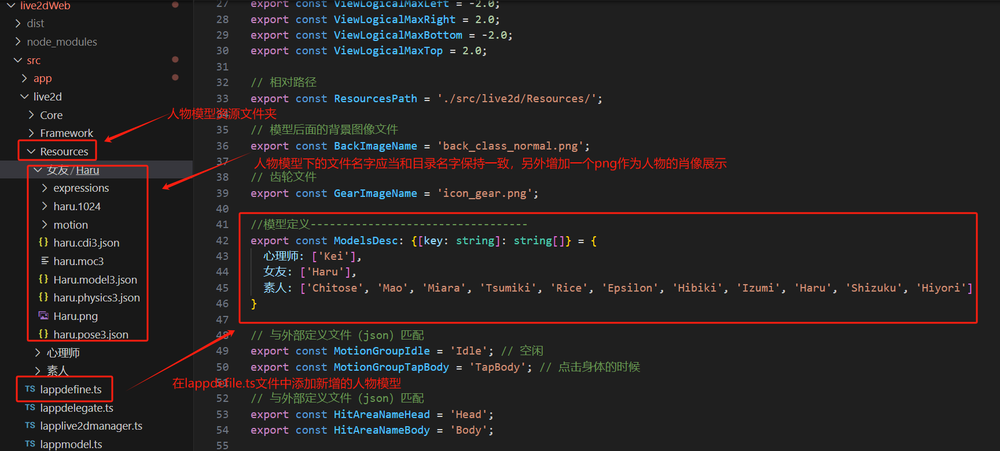
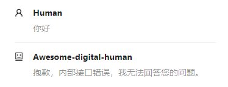

# AWESOME-DIGITAL-HUMAN
**打造一个有温度的数字人**  
**给数字人注入灵魂**  
---  
###### *业务时间发电，你的star是我最大的动力，感谢！*
---  

## 演示
https://github.com/wan-h/awesome-digital-human-live2d/assets/33694585/776b6fc8-8fad-4c61-a14d-660346c6fb5b

## 部署
推荐使用容器部署，本地开发使用裸机开发部署
### 系统要求
请确保您的机器满足以下最低系统要求：  
* CPU >= 2 Core
* RAM >= 2GB
### 裸机开发部署 - Ubuntu示例
> 基础环境
* python3.10（使用其他版本以及对应的库理论上也是可以的）
> 运行
* 源码下载
```bash
# 下载源码
git clone https://github.com/wan-h/awesome-digital-human-live2d.git
```
* 运行server
```bash
# 安装依赖
pip install -r requirements.txt
# 安装ffmpeg
sudo apt install ffmpeg
# 启动
python main.py
```
* 运行web
```bash
cd live2dWeb
# 安装依赖
npm install
# 编译发布版本
npm run build:prod
# 启动
npm run serve
```
* 测试
(配置好各个配置文件的key后才能跑通单元测试)  
```bash
# 运行整个测试
pytest test
# 运行单个测试脚本
pytest test/test_agent_api.py
# 运行单个测试用例
pytest test/test_agent_api.py::Test_AGENT_API::test_repeater_text_infer
```
### 容器部署
> 基础环境
* 安装[docker-compose](https://docs.docker.com/compose/install/)
> 运行
* 启动服务
```bash
docker-compose -f docker-compose.yaml up -d
```
### 访问页面
浏览器访问路径: http://localhost:8000  


## 配置文件说明
由于扩展的多样性，通过一个全局的配置文件管理各个模块的子配置文件    
配置文件的目录结构如下:  
```bash
.
├── config.yaml                  # 全局配置文件
├── agents                       # agent 配置文件目录
│   ├── dialogue.yaml            # 对话模式配置
│   └── repeater.yaml            # 复读机模式配置
└── engines                      # 引擎配置文件目录
    ├── asr                      # 语音识别引擎配置文件目录
    │   ├── baiduAPI.yaml        # baidu 语音识别配置
    │   └── googleAPI.yaml       # google 语音识别配置
    ├── llm                      # 大模型引擎配置文件目录
    │   ├── baiduAPI.yaml        # baidu 大模型配置
    │   └── openaiAPI.yaml       # openai 大模型配置
    └── tts                      # 文字转语音引擎配置目录
        ├── baiduAPI.yaml        # baidu 文字转语音配置
        └── edgeAPI.yaml         # edge 文字转语音配置
```
[全局配置](configs/config.yaml)文件中的内容如下:  
```yaml
COMMON:                                                      # 通用配置项
  NAME: "Awesome-Digital-Human"                              # 名字
  VERSION: "v0.0.1"                                          # 版本
  LOG_LEVEL: "DEBUG"                                         # 日志等级
SERVER:                                                      # 服务配置项
  IP: "0.0.0.0"                                              # 服务启动IP
  PORT: 8080                                                 # 服务启动端口
  ENGINES:                                                   # 引擎配置项
    ASR:                                                     # 语音识别配置项
      SUPPORT_LIST: [ "baiduAPI.yaml" ]                      # 支持的语音识别列表(这些配置文件应当在configs/engines/asr目录下)
      DEFAULT: "baiduAPI.yaml"                               # 默认使用的语音识别配置
    LLM:                                                     # 大模型配置项
      SUPPORT_LIST: [ "openaiAPI.yaml", "baiduAPI.yaml" ]    # 支持的大模型列表(这些配置文件应当在configs/engines/llm目录下)
      DEFAULT: "baiduAPI.yaml"                               # 默认使用的大模型配置
    TTS:                                                     # 文字转语音配置项
      SUPPORT_LIST: [ "edgeAPI.yaml", "baiduAPI.yaml" ]      # 支持的文字转语音列表(这些配置文件应当在configs/engines/tts目录下)
      DEFAULT: "edgeAPI.yaml"                                # 默认使用的文字转语音配置
  AGENTS:                                                    # Agent 配置项目
    SUPPORT_LIST: [ "repeater.yaml", "dialogue.yaml" ]       # 支持的Agent列表(这些配置文件应当在configs/agents目录下)
    DEFAULT: "dialogue.yaml"                                 # 默认使用的Agent配置
```

## 定制化开发
### 人物模型
（需要live2d支持的模型）
* 人物模型控制使用 [live2d web SDK](https://www.live2d.com/en/sdk/about/)  
* 人物模型均来自 [live2d官方免费素材](https://www.live2d.com/zh-CHS/learn/sample/)  
* 人物模型添加流程

### 后端扩展
（后端引擎均通过注册的方式）
以openai大模型为例:  
* 新增llm配置文件  

* 全局配置文件支持新增的llm  

* llm推理实现并注册  


## Tips
* 前端默认使用复读机模型  
* 后端tts默认使用edge-tts(不需要申请key)  
* 后端llm默认使用BaiduAPI(需要申请key)  
* 切换到对话模式时需要在[百度智能云](https://console.bce.baidu.com/qianfan/ais/console/applicationConsole/application)
申请AK和SK后填写到[baiduAPI.yaml](configs/engines/llm/baiduAPI.yaml)配置文件中  
* 切换到对话模式没有正确配置key时会出现如下回复:  
  

## 分享
**知乎板块**:  
[数字人-定义数字世界中的你](https://zhuanlan.zhihu.com/p/676746017)  
  
**微信公众号板块**:  
[数字人-定义数字世界中的你](https://mp.weixin.qq.com/s/SQvFysHO8daN0HMA0AaJZw)  

## 兴趣小组 
**扫码加群**  

