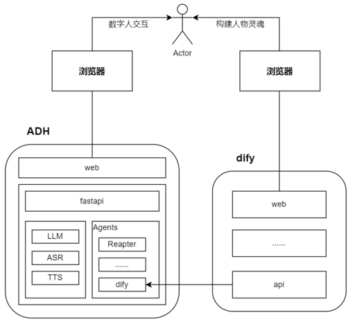

# AWESOME-DIGITAL-HUMAN
**打造一个有温度的数字人**  
**给数字人注入灵魂**  
---  
🎉🎉🎉 社区官网公测版本正式发布: https://www.light4ai.com  
官方支持(详情见[操作指南](https://light4ai.feishu.cn/docx/XmGFd5QJwoBdDox8M7zcAcRJnje)):  
* 个人应用管理  
* 内置服务接入  
* 限定主题  
* 应用分享
###### *社区业余时间发电，你的star是我们最大的动力，感谢！*
---  

## 演示
https://github.com/user-attachments/assets/0650c443-d19b-4d5e-a409-5eed9a9ea9f7

## 主要特性
* 支持 Docker 快速部署
* 超轻量级，配置要求低于2核2G
* 支持 Dify/FastGPT 等编排框架服务接入
* 支持 ASR、LLM、TTS、Agent 模块化扩展
* 支持 Live2d 人物模型扩展和控制方式
* 支持PC端和移动端web访问
* 支持智能对话  
PC端页面预览：  
  
移动端页面预览：  

## 设计架构
大模型的厂商众多、各种工具繁多、要打造自己的数字人需要一定的代码能力和时间投入。
基于Dify等框架健全的应用模版和编排框架，让一切变得更加简单。  

## 模式支持
> **交互模式**  
* 对话模式：专注于数字人文字交互  
* 沉浸模式：专注与数字人之间拟人方式的直接交互  
> **Agent模式**
* ReapterAgent（测试使用）：重复用户输入的语句  
* DifyAgent：接入Dify的服务  
* FastgptAgent：接入fastgpt的服务  
* OpenaiAgent：接入适配openai接口的服务  

## 版本记录
> ### v1.0.0
**界面简约，注重模块扩展性**
* [v1.0.0 - 2024-06-25](https://github.com/wan-h/awesome-digital-human-live2d/tree/v1.0.0)
  * 前端架构：react + antD
  * 后端架构：fastapi
  * ASR已接入：baiduAPI、googleAPI
  * LLM已接入：baiduAPI、openaiAPI
  * TTS已接入：baiduAPI、edgeAPI
  * Agent支持：repeater(复读机)、dialogue(对话)
  * 人物类型支持：女友（1）、心理师（1）、素人（11）
> ### v2.0.0
**拥抱Dify生态，打造自己的数字人灵魂**
* [v2.0.0 - 2024-08-08](https://github.com/wan-h/awesome-digital-human-live2d/tree/v2.0.0)
  * 前端页面全面升级：nextjs + nextui + tailwind
  * 前端页面兼容移动端访问
  * 前端支持两种交互模式：聊天模式、数字人模式
  * 前端支持人物模型和背景切换以及个人定制扩展
  * Agent支持：difyAgent（ASR、TTS均可接入Dify）、FastGPTAgent、OpenaiAgent
> ### v3.0.0
**强化交互体验**
* [v3.0.0 - 2024-06-01](https://github.com/wan-h/awesome-digital-human-live2d/tree/main)
  * 前端页面全面升级：nextjs + heroui + tailwind
  * 支持动态背景
  * 沉浸模式（实时交互、对话打断等等直接交互方式优化）

## 部署&开发
[部署说明](./docs/deploy_instrction.md)  
[开发说明](./docs/developer_instrction.md)  
[v2.0.0 常见问题](./docs/Q&A.md)  

[v2.0.0 B站视频教程-部署](https://www.bilibili.com/video/BV1szePeaEak/)  
[v2.0.0 B站视频教程-All-in-Dify部署](https://www.bilibili.com/video/BV1kZWvesE25/)

## Love & Share
**知乎板块**  
[数字人-定义数字世界中的你](https://zhuanlan.zhihu.com/p/676746017)  
[RAG架构浅析](https://zhuanlan.zhihu.com/p/703262854)  
[dify源码解析-RAG](https://zhuanlan.zhihu.com/p/704341817)  
[RAG-索引之PDF文档解析](https://zhuanlan.zhihu.com/p/707271297)  
[Dify打造专属数字人灵魂](https://zhuanlan.zhihu.com/p/714961925)  
[数字人的All in Dify](https://zhuanlan.zhihu.com/p/716359038)
  
**微信公众号板块**  
[数字人-定义数字世界中的你](https://mp.weixin.qq.com/s/SQvFysHO8daN0HMA0AaJZw)  
[RAG架构浅析](https://mp.weixin.qq.com/s/4iWrJonD8_kjxw4ILibzSw)  
[dify源码解析-RAG](https://mp.weixin.qq.com/s/muCTFTWLY8j5UtxwCaW93A)  
[RAG-索引之PDF文档解析](https://mp.weixin.qq.com/s/innbTL6aeOsl9vyJSN6yBw)  
[Dify打造专属数字人灵魂](https://mp.weixin.qq.com/s/3B4YgYjDY42DNTgE76XOtw)  
[数字人的All in Dify](https://mp.weixin.qq.com/s/Uf17jWpjVzAfzX42TP09gw)

**Dify 官方板块**  
[Dify公众号文章：使用 Dify 打造数字人灵魂](https://mp.weixin.qq.com/s?__biz=Mzg5MDkyOTY3NA==&mid=2247486070&idx=3&sn=0911ba8723278a83c1554afd2de861ab&chksm=cefc58effe2456e39a9f0f0afac4ec5447bb1aafff42a68d05b2a3f523baae299b93d7ae6ff9&mpshare=1&scene=1&srcid=1021NXKMC2W697dCXEwqsCkN&sharer_shareinfo=93041ce9bdefcde0aa121d27a3f3f6dd&sharer_shareinfo_first=8c8f03435bc9af5236a4505b831d1388&exportkey=n_ChQIAhIQQaNAHzm7bGdYinsq2L2zbRKfAgIE97dBBAEAAAAAANTKKNX7j3cAAAAOpnltbLcz9gKNyK89dVj0%2F3Ojxo5%2FA9C00dmnAyJraAwSYIfMr4csl8xZvE%2FSwCi3nKbPJZ4mnLdQdVm2EQP2SNJQIMUqV1PGB%2BGpSSdjOs6L7ejtFS9GCpkr6LMmAKVW904Tu4tGhZwjaU14QjLRGXZ7rQEKMOQjdQTyDf%2BluwFEDAXlLMozezq6ypTwXIu0HoLjs4Q6x4gtHS%2BpH6vhOfGgR7LtVbZcXAFFWokyvREiMuHayOSrjtpDD9CQK5KYELY7Ejd%2B48JRj7dRJZiAGebg2KRYtB7%2BpJqgyKaNO4mCcT%2BT9KjHq4WIssWaF0Vq5G4D2el%2FhIgfuEpreoR1hUKOMkcBiAXZ&acctmode=0&pass_ticket=Tg8MLw6UPqgdcjRxs7YP26i09LNlJcKEH%2Bw9YwPdaE4OzNwhW7RbDzgVM3X5rkY1&wx_header=0#rd)

**产研板块**  
[数字人调研问卷](https://ec5cjmeodk.feishu.cn/share/base/dashboard/shrcnu1DNMUCTU18f5tF2q9qoQh)（感谢 [@plumixius](https://github.com/plumixius) 同学）

## Thanks
### 开源项目
* [Dify](https://github.com/langgenius/dify)  
* [Live2D](https://github.com/Live2D)  
* 源码中涉及到的所有库作者

## 社区联系
**扫码请备注 ADH**    
| 商务合作 | 兴趣小组 |
| --- | --- |
|  |  |