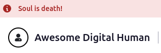
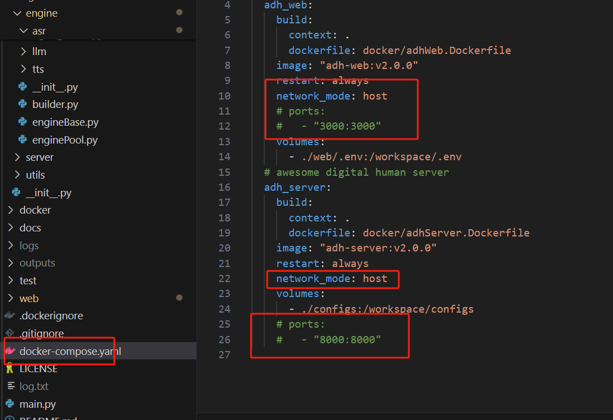

## AWESOME-DIGITAL-HUMAN-常见问题

### 前端页面提升 *Soul is Death!*
页面呈现：  
  
原因：后端服务未通。  
相关说明：  
前端和后端保持每秒一次的心跳包，心跳包丢失显示该字样，刚启动时可能会闪现一下。前端暴露端口为3000，后端暴露端口为8000，检查后端服务是否启动以及端口是否正确暴露。  
前端请求后端的地址为：http://server_ip:server_port/，其中 server_ip 默认为前端网页地址的hostname， port 默认为8000。可以在`awesome-digital-human-live2d/web/.env`中手动指定后端服务地址和端口。  
对于想在公网通过nginx代理的同学，可以将`/adh`开头的请求反向代理到后端端口，因为后端接口都是`/adh`开头的，另外可以直接通过`http://server_ip:server_port/docs`访问后端接口文档，例如：`http://localhost:8000/docs`。

### 是否支持人物定制
支持，具体参考[开发说明](./docs/developer_instrction.md)中的定制化开发部分。

### windows系统docker启动无法访问页面
windows不支持docker的host模式，修改`awesome-digital-human-live2d/docker-compose.yaml`：  
* 删除network字段
* 打开ports的注释  
