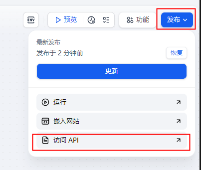
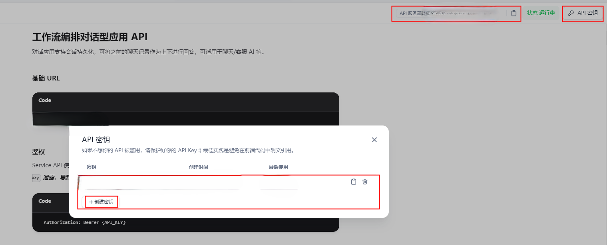
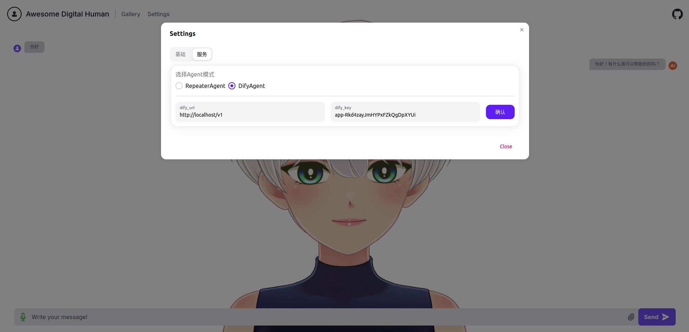

## AWESOME-DIGITAL-HUMAN-部署指南

推荐使用容器部署，本地开发使用裸机开发部署

### 系统要求
请确保您的机器满足以下最低系统要求：  
* CPU >= 2 Core
* RAM >= 2GB
### 裸机开发部署 - Ubuntu示例
> 基础环境
* python3.10（使用其他版本以及对应的库理论上也是可以的）
* node 推荐 20
> 运行
* 源码下载
```bash
# 下载源码
git clone https://github.com/wan-h/awesome-digital-human-live2d.git
```
* 运行server
```bash
# 安装依赖
pip install -r requirements.txt
# 安装ffmpeg
sudo apt install ffmpeg
# 启动
python main.py
```
* 运行web
```bash
cd web
# 安装依赖
npm install
# 编译发布版本
npm run build
# 启动
npm run start
```

### 容器部署（推荐）
> 基础环境
* 安装[docker-compose](https://docs.docker.com/compose/install/)
> 运行
* 启动容器
```bash
# 项目根目录下执行
docker-compose up -d
```

### 访问页面
本地浏览器访问路径: http://localhost:3000  
非本地浏览器访问路径: http://{部署服务器IP}:3000

### 接入Dify
#### 部署dify
有两种方式可以接入dify服务，一种是使用dify的云服务，一种是自己私有化部署dify：  
* [dify云服务地址](https://cloud.dify.ai/)  
* 私有化部署推荐参考[Docker Compose部署指南](https://docs.dify.ai/v/zh-hans/getting-started/install-self-hosted/docker-compose)(0.6.16已测试)  
#### 构建属于自己的dify应用
关于dify的使用说明参考[dify官方文档](https://docs.dify.ai/v/zh-hans)
#### 获取dify API & 密钥
构建完成自己的应用后，点击 **发布**、**运行**，然后点击 **访问API** 获取API地址和密钥  
  
在 **访问API** 页面，右上角分别可以获取API地址和创建API密钥

#### 配置dify API & 密钥
数字人页面上点击 **Settings、服务、DifyAgent**，将获取到的API地址和密钥分别填入 **dify_url、dify_key** 即可
  
如果想修改默认值，直接修改`awesome-digital-human-live2d/configs/agents/difyAgent.yaml`中的`DEFAULT`字段，前端会按照默认值自动填充

### 其他说明
#### 前端环境变量
`web/.env`中有四个字段可配置为前端服务（修改后删除镜像重新构建前端容器生效）：
* `NEXT_PUBLIC_ADH_SERVER_IP`：后端服务地址，默认为浏览器的hostname
* `NEXT_PUBLIC_ADH_SERVER_PORT`：后端服务端口，默认为8000
* `NEXT_PUBLIC_ADH_SERVER_VERSION`：API访问地址，默认为`v0`

#### 暴露端口
* 前端端口：`awesome-digital-human-live2d/web/package.json`中的启动脚本中`"start": "next start -p 3000"`，其中`-p`指定了启动端口
* 后端端口：配置文件`awesome-digital-human-live2d/configs/config.yaml`中`PORT`字段指定了启动端口

#### 快捷按键
* `Ctr + M`：开启关闭语音（ASR默认使用google的遗弃免费接口，不好使的话就换成其他的）