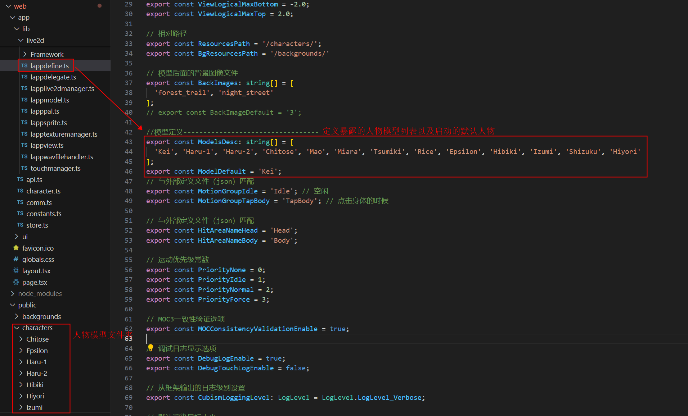
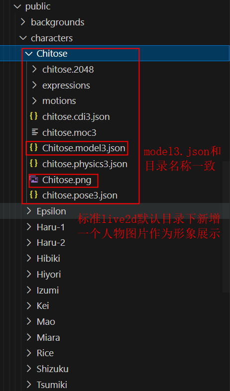
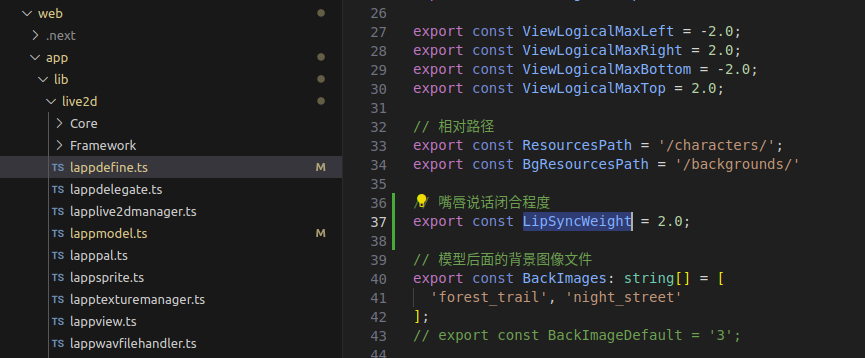
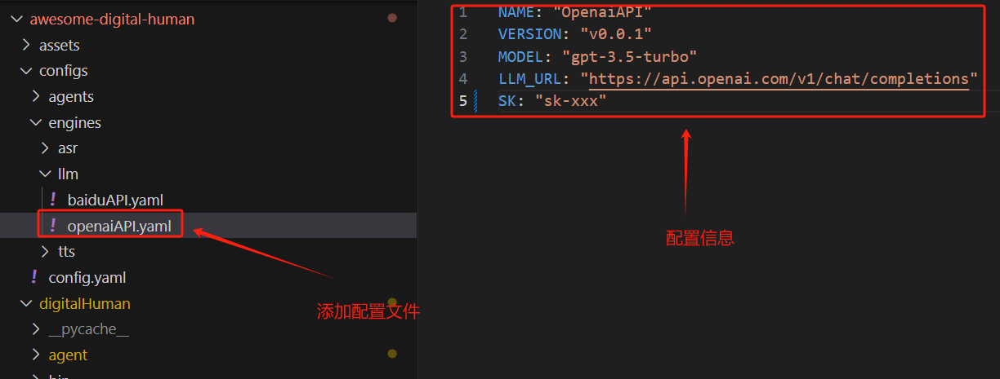
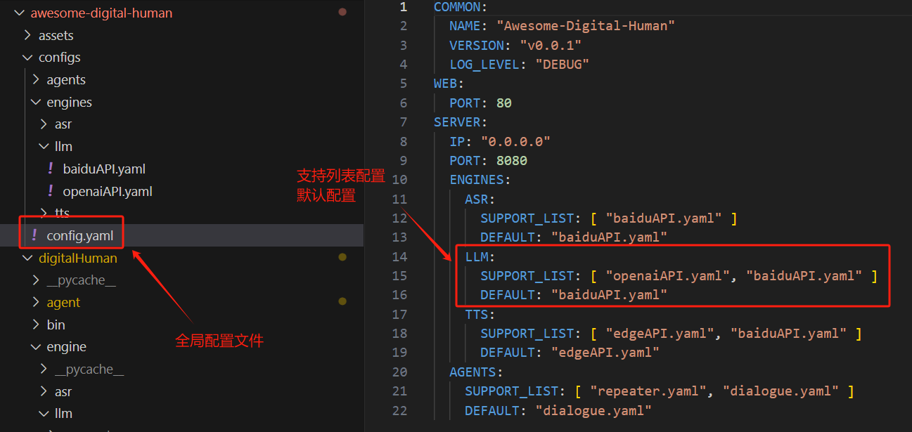
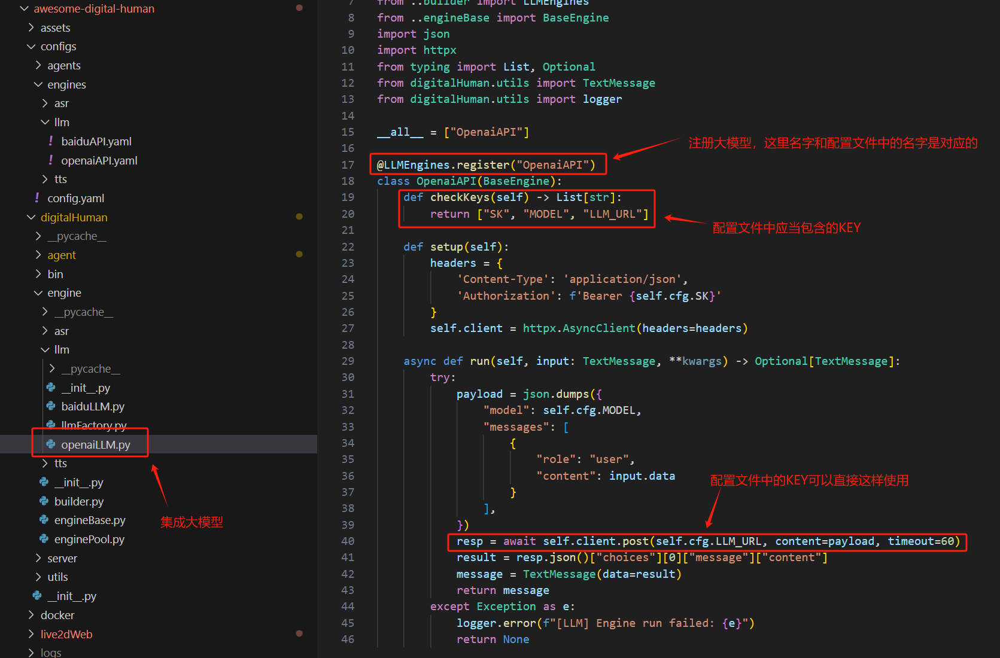
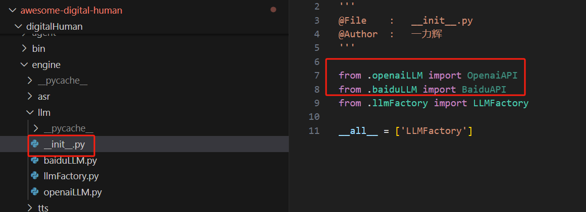
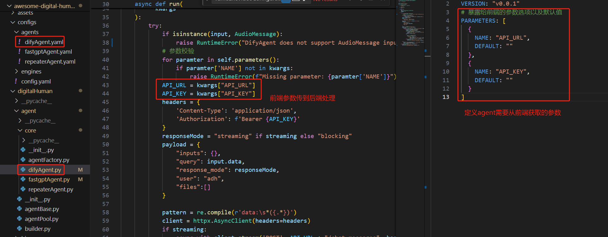

## AWESOME-DIGITAL-HUMAN-开发指南

### 配置文件说明
由于扩展的多样性，通过一个全局的配置文件管理各个模块的子配置文件    
配置文件的目录结构如下:  
```bash
.
├── config.yaml                  # 全局配置文件
├── agents                       # agent 配置文件目录
│   ├── difyAgent.yaml           # dify模式配置
│   └── repeaterAgent.yaml       # 复读机模式配置
└── engines                      # 引擎配置文件目录
    ├── asr                      # 语音识别引擎配置文件目录
    │   ├── baiduAPI.yaml        # baidu 语音识别配置
    │   └── googleAPI.yaml       # google 语音识别配置
    ├── llm                      # 大模型引擎配置文件目录
    │   ├── baiduAPI.yaml        # baidu 大模型配置
    │   └── openaiAPI.yaml       # openai 大模型配置
    └── tts                      # 文字转语音引擎配置目录
        ├── baiduAPI.yaml        # baidu 文字转语音配置
        └── edgeAPI.yaml         # edge 文字转语音配置
```
[全局配置](configs/config.yaml)文件中的内容如下:  
```yaml
COMMON:                                                      # 通用配置项
  NAME: "Awesome-Digital-Human"                              # 名字
  VERSION: "v0.0.1"                                          # 版本
  LOG_LEVEL: "DEBUG"                                         # 日志等级
SERVER:                                                      # 服务配置项
  IP: "0.0.0.0"                                              # 服务启动IP
  PORT: 8000                                                 # 服务启动端口
  ENGINES:                                                   # 引擎配置项
    ASR:                                                     # 语音识别配置项
      SUPPORT_LIST: [ "baiduAPI.yaml", "googleAPI.yaml" ]    # 支持的语音识别列表(这些配置文件应当在configs/engines/asr目录下)
      DEFAULT: "googleAPI.yaml"                              # 默认使用的语音识别配置
    LLM:                                                     # 大模型配置项
      SUPPORT_LIST: [ "openaiAPI.yaml", "baiduAPI.yaml" ]    # 支持的大模型列表(这些配置文件应当在configs/engines/llm目录下)
      DEFAULT: "baiduAPI.yaml"                               # 默认使用的大模型配置
    TTS:                                                     # 文字转语音配置项
      SUPPORT_LIST: [ "edgeAPI.yaml", "baiduAPI.yaml" ]      # 支持的文字转语音列表(这些配置文件应当在configs/engines/tts目录下)
      DEFAULT: "edgeAPI.yaml"                                # 默认使用的文字转语音配置
  AGENTS:                                                    # Agent 配置项目
    SUPPORT_LIST: [ "repeaterAgent.yaml", "difyAgent.yaml" ] # 支持的Agent列表(这些配置文件应当在configs/agents目录下)
    DEFAULT: "repeaterAgent.yaml"                            # 默认使用的Agent配置
```

### 定制化开发
#### 人物模型
（需要live2d支持的模型）  
* 人物模型控制使用 [live2d web SDK](https://www.live2d.com/en/sdk/about/)  
* 人物模型均来自 [live2d官方免费素材](https://www.live2d.com/zh-CHS/learn/sample/)  
* 人物模型添加流程  
（已经上传的人物模型中已经支持了很多的表情和动作，有能力的同学可以自己探索玩儿一下）


* 唇形同步  
如果想增加或则减小嘴唇根据语音的闭合程度，修改 LipSyncWeight 权重值

#### 背景图片
添加图片到`awesome-digital-human-live2d/web/public/backgrounds`目录下并在`awesome-digital-human-live2d/web/app/lib/live2d/lappdefine.ts`中修改字段`BackImages`添加图片名称即可
#### 后端模块扩展
（后端引擎均通过注册的方式，asr、llm、tts、agent方式相同）
##### 常规引擎  
对于asr、llm、tts的扩展实现在`digitalHuman/engine`目录下，也可以依葫芦画瓢扩展更多的引擎，以扩展openai大模型为例（这里只是作为一个示例，使用difyAgent后并不会再使用llm engine）:  
* 新增llm配置文件  

* 全局配置文件支持新增的llm  

* llm推理实现并注册  

* 模块入口函数引用(动态注册的方式，需要被import一下)  

##### agent
对于agent的扩展实现在`digitalHuman/agent/core`目录下，扩展方式和常规引擎相同，这里的agent可以使用上面的常规引擎自己构建，也可以接入像dify这样的编排框架平台  
唯一不同点在于agent需要向前端暴露参数，可以通过在配置文件中暴露参数，前端根据暴露的参数渲染，同时会使用这设置的默认值  
