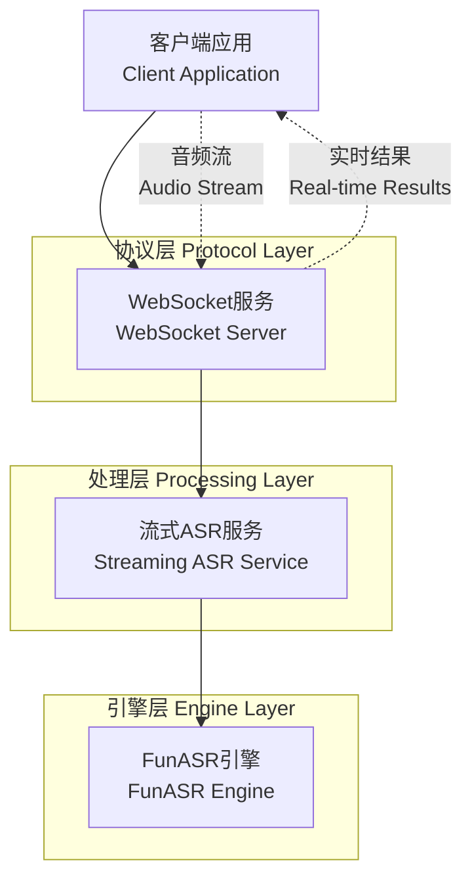
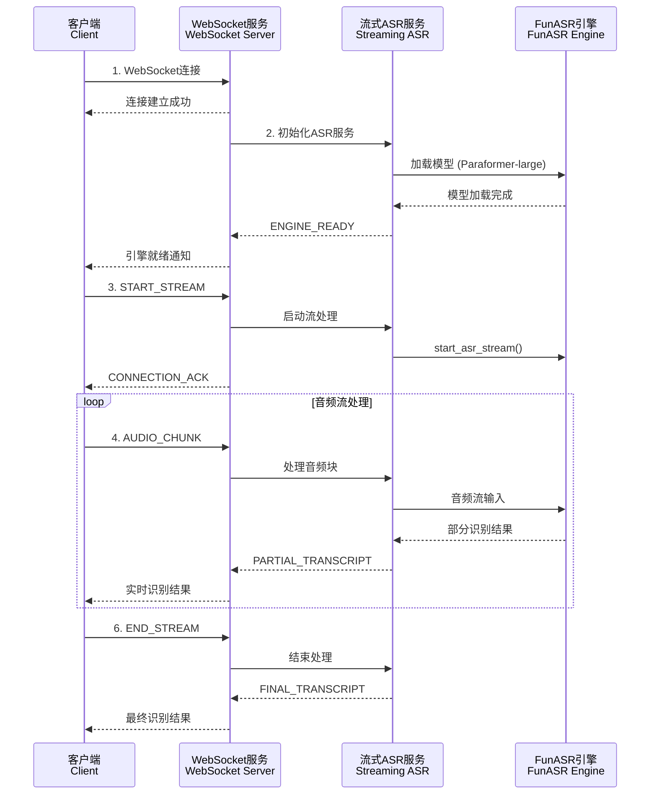

# 流式ASR协议文档

## 概述

流式ASR (Automatic Speech Recognition) 功能为数字人项目提供了实时语音识别能力。通过WebSocket协议，客户端可以实时发送音频流并接收识别结果，支持部分识别结果和最终识别结果的实时返回。

## 架构设计

流式ASR系统采用分层架构设计：

```
客户端应用 <---> WebSocket服务 <---> 流式ASR服务 <---> FunASR引擎
```

### 系统架构图



### 通信时序图



```
┌─────────────────┐    WebSocket     ┌─────────────────┐    异步处理      ┌─────────────────┐
│                 │ ◄──────────────► │                 │ ◄──────────────► │                 │
│   客户端应用     │                  │  StreamingASR   │                  │  FunASR引擎     │
│                 │                  │     服务        │                  │                 │
└─────────────────┘                  └─────────────────┘                  └─────────────────┘
       │                                       │                                       │
       │ 1. 建立WebSocket连接                    │                                       │
       │ ──────────────────────────────────────►│                                       │
       │                                       │ 2. 初始化ASR引擎                       │
       │                                       │ ──────────────────────────────────────►│
       │ 3. 发送START_STREAM                     │                                       │
       │ ──────────────────────────────────────►│                                       │
       │                                       │ 4. 启动识别会话                        │
       │                                       │ ──────────────────────────────────────►│
       │ 5. 发送音频数据块                        │                                       │
       │ ──────────────────────────────────────►│ 6. 流式处理音频                        │
       │                                       │ ──────────────────────────────────────►│
       │ 7. 接收部分识别结果                      │                                       │
       │ ◄──────────────────────────────────────│ ◄──────────────────────────────────────│
       │ 8. 发送FINAL_CHUNK                      │                                       │
       │ ──────────────────────────────────────►│ 9. 处理最终音频块                       │
       │                                       │ ──────────────────────────────────────►│
       │ 10. 接收最终识别结果                     │                                       │
       │ ◄──────────────────────────────────────│ ◄──────────────────────────────────────│
       │ 11. 发送END_STREAM                      │                                       │
       │ ──────────────────────────────────────►│                                       │
```

## 协议规范

### 二进制协议格式

所有WebSocket消息都使用统一的二进制协议格式：

```
┌──────────────────┬──────────────────┬──────────────────┐
│   Action (18字节) │ Payload Size (4字节) │   Payload (可变)   │
│                  │                  │                  │
│  UTF-8编码字符串   │   大端序无符号整数   │    实际数据内容     │
│  右侧空格填充      │                  │                  │
└──────────────────┴──────────────────┴──────────────────┘
```

- **Action**: 18字节固定长度，UTF-8编码的操作类型，右侧用空格填充
- **Payload Size**: 4字节大端序无符号整数，表示Payload的字节长度
- **Payload**: 可变长度的实际数据内容

### 消息类型定义

#### 客户端请求类型

| Action | 描述 | Payload |
|--------|------|--------|
| `START_STREAM` | 开始流式识别 | 空 |
| `AUDIO_CHUNK` | 普通音频数据块 | 音频二进制数据 |
| `FINAL_CHUNK` | 最终音频数据块 | 音频二进制数据 |
| `END_STREAM` | 结束流式识别 | 空 |
| `PING` | 心跳包 | 空 |

#### 服务端响应类型

| Action | 描述 | Payload |
|--------|------|--------|
| `CONNECTION_ACK` | 连接确认 | 空 |
| `ENGINE_READY` | 引擎就绪 | 空 |
| `STREAM_STARTED` | 流开始确认 | 空 |
| `PARTIAL_TRANSCRIPT` | 部分识别结果 | UTF-8编码的文本 |
| `FINAL_TRANSCRIPT` | 最终识别结果 | UTF-8编码的文本 |
| `STREAM_ENDED` | 流结束确认 | 空 |
| `ERROR` | 错误信息 | UTF-8编码的错误描述 |
| `PONG` | 心跳响应 | 空 |

### 连接状态机

```
┌─────────┐  START_STREAM   ┌──────────────┐  音频数据处理完成  ┌────────────┐
│  IDLE   │ ──────────────► │  LISTENING   │ ─────────────────► │ PROCESSING │
└─────────┘                 └──────────────┘                    └────────────┘
     ▲                              │                                   │
     │                              │ ERROR                             │ ERROR
     │                              ▼                                   ▼
     │                         ┌─────────┐  END_STREAM              ┌─────────┐
     └─────────────────────────│  ERROR  │ ◄────────────────────────│  ERROR  │
                               └─────────┘                          └─────────┘
                                    │                                   │
                                    │ 重置连接                           │
                                    ▼                                   ▼
                               ┌─────────┐ ◄────────────────────────────┘
                               │  IDLE   │
                               └─────────┘
```

## 音频格式要求

- **采样率**: 16000 Hz
- **声道数**: 1 (单声道)
- **位深度**: 16 bit
- **格式**: PCM
- **字节序**: 小端序
- **推荐块大小**: 15360字节 (约240ms音频)

## 使用示例

### WebSocket连接

```
ws://localhost:8000/adh/streaming_asr/ws/asr/v0/stream
```

### 典型交互流程

1. **建立连接**
   ```
   客户端 → 服务器: WebSocket连接请求
   服务器 → 客户端: CONNECTION_ACK
   服务器 → 客户端: ENGINE_READY
   ```

2. **开始识别**
   ```
   客户端 → 服务器: START_STREAM
   服务器 → 客户端: STREAM_STARTED
   ```

3. **发送音频数据**
   ```
   客户端 → 服务器: AUDIO_CHUNK (音频数据)
   服务器 → 客户端: PARTIAL_TRANSCRIPT ("你好")
   
   客户端 → 服务器: AUDIO_CHUNK (音频数据)
   服务器 → 客户端: PARTIAL_TRANSCRIPT ("你好世界")
   
   客户端 → 服务器: FINAL_CHUNK (最后的音频数据)
   服务器 → 客户端: FINAL_TRANSCRIPT ("你好世界！")
   ```

4. **结束识别**
   ```
   客户端 → 服务器: END_STREAM
   服务器 → 客户端: STREAM_ENDED
   ```

## 错误处理

### 常见错误类型

- **协议错误**: 消息格式不正确
- **引擎错误**: ASR引擎初始化或处理失败
- **音频格式错误**: 音频数据格式不符合要求
- **状态错误**: 在错误的连接状态下发送消息

### 错误响应格式

```json
{
  "error_code": "PROTOCOL_ERROR",
  "message": "Invalid message format",
  "details": "Expected binary message with valid header"
}
```

## 性能优化

### 音频缓冲策略

- 客户端应维护音频缓冲区，按推荐块大小发送
- 避免发送过小的音频块，影响识别效果
- 合理控制发送频率，避免网络拥塞

### 连接管理

- 实现心跳机制，定期发送PING消息
- 处理网络断线重连
- 合理设置WebSocket超时参数

## 安全考虑

- 验证音频数据大小，防止过大payload攻击
- 限制连接数量和频率
- 实现适当的身份验证机制
- 记录详细的操作日志