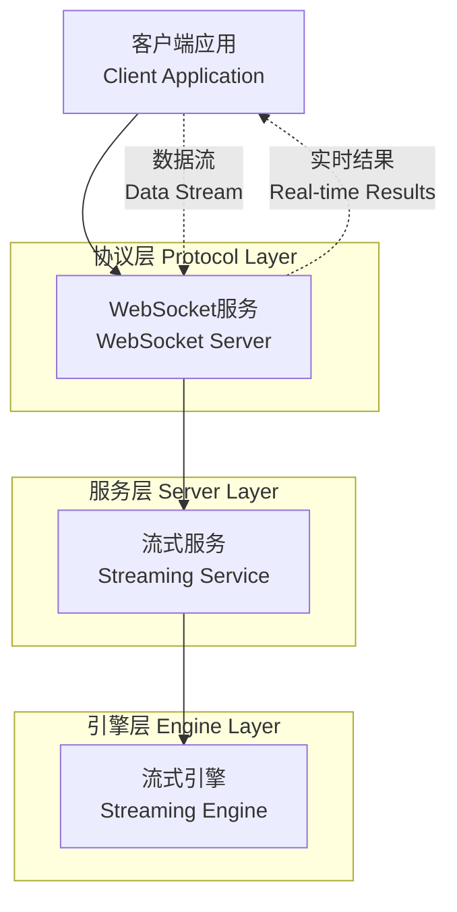
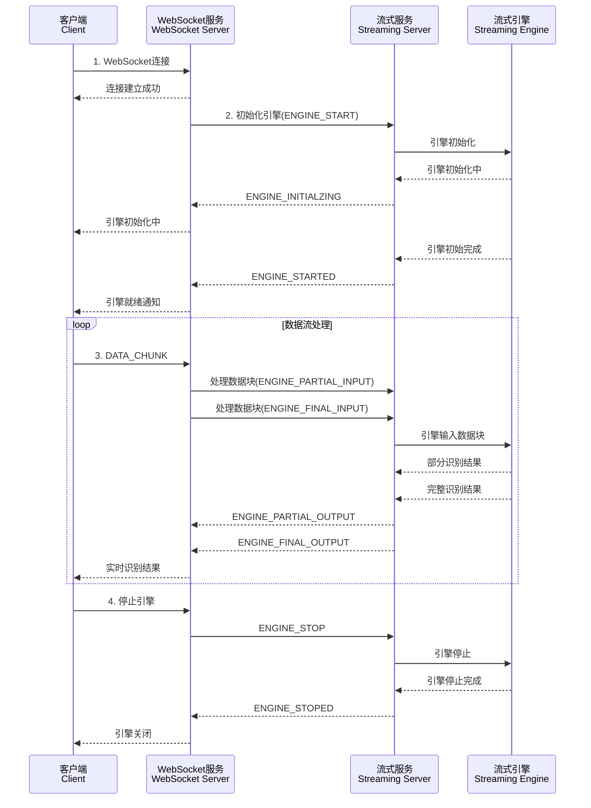

# 流式ASR协议文档

## 概述

通过WebSocket协议，客户端可以实时发送数据流并接收识别结果，支持部分识别结果和最终识别结果的实时返回。

## 架构设计

流式ASR系统采用分层架构设计：

```
客户端应用 <---> WebSocket服务 <---> 流式服务 <---> 模型引擎
```

### 系统架构图



### 通信时序图



## 协议规范

### 二进制协议格式

所有WebSocket消息都使用统一的二进制协议格式：

```
┌──────────────────┬──────────────────────┬──────────────────┐
│  Action (18字节)  │ Payload Size (4字节) │   Payload (可变)  │
│                  │                      │                  │
│  UTF-8编码字符串   │    大端序无符号整数    │    实际数据内容    │
│  右侧空格填充      │                      │                  │
└──────────────────┴──────────────────────┴──────────────────┘
```

- **Action**: 18字节固定长度，UTF-8编码的操作类型，右侧用空格填充
- **Payload Size**: 4字节大端序无符号整数，表示Payload的字节长度
- **Payload**: 可变长度的实际数据内容

### 消息类型定义

#### 客户端请求类型

| Action | 描述 | Payload |
|--------|------|--------|
| `ENGINE_START` | 开始流式识别 | 空 |
| `ENGINE_PARTIAL_INPUT` | 普通数据块 | 二进制数据 |
| `ENGINE_FINAL_INPUT` | 最终数据块 | 二进制数据 |
| `ENGINE_STOP` | 结束流式识别 | 空 |
| `PING` | 心跳包 | 空 |

#### 服务端响应类型

| Action | 描述 | Payload |
|--------|------|--------|
| `ENGINE_INITIALZING` | 引擎初始化 | 空 |
| `ENGINE_STARTED` | 引擎就绪 | 空 |
| `ENGINE_PARTIAL_OUTPUT` | 部分识别结果 | 二进制数据 |
| `ENGINE_FINAL_OUTPUT` | 最终识别结果 | 二进制数据 |
| `ENGINE_STOPPED` | 关闭引擎 | 空 |
| `ERROR` | 错误信息 | 二进制数据(错误描述) |
| `PONG` | 心跳响应 | 空 |

## 性能优化

### 数据缓冲策略

- 客户端应维护数据缓冲区，按推荐块大小发送
- 避免发送过小的音频块，影响识别效果
- 合理控制发送频率，避免网络拥塞

### 连接管理

- 实现心跳机制，定期发送PING消息
- 处理网络断线重连
- 合理设置WebSocket超时参数

## 安全考虑

- 验证数据大小，防止过大payload攻击
- 限制连接数量和频率
- 实现适当的身份验证机制
- 记录详细的操作日志